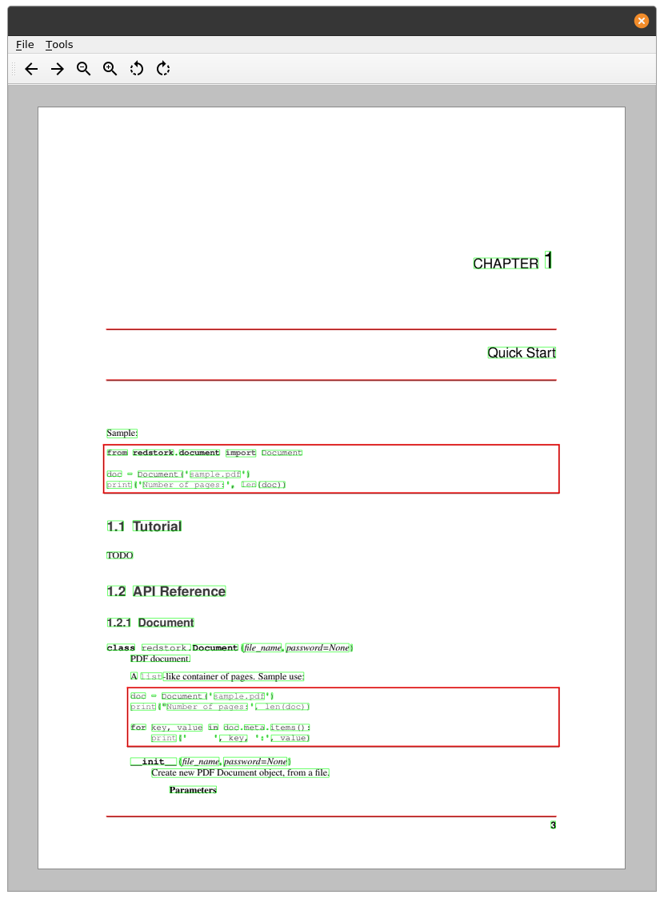

# redstork-ui

A simple PDF viewer, demonstrating how to use [redstork](http://github.com/innodatalabs/redstork) PDF parser.

<p align="center"></p>

## Requirements

1. Python 3.6+

## Running

We recommend using virtual environment
```
python3 -m venv .venv
. .venv/bin/activate
pip install -r requirements.txt

python -m ui
```